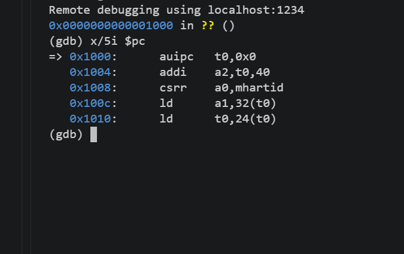
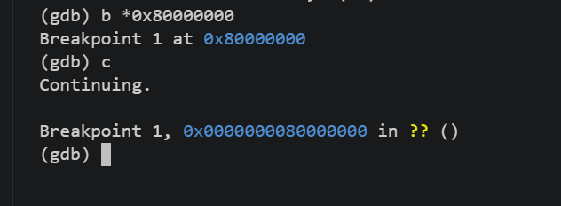
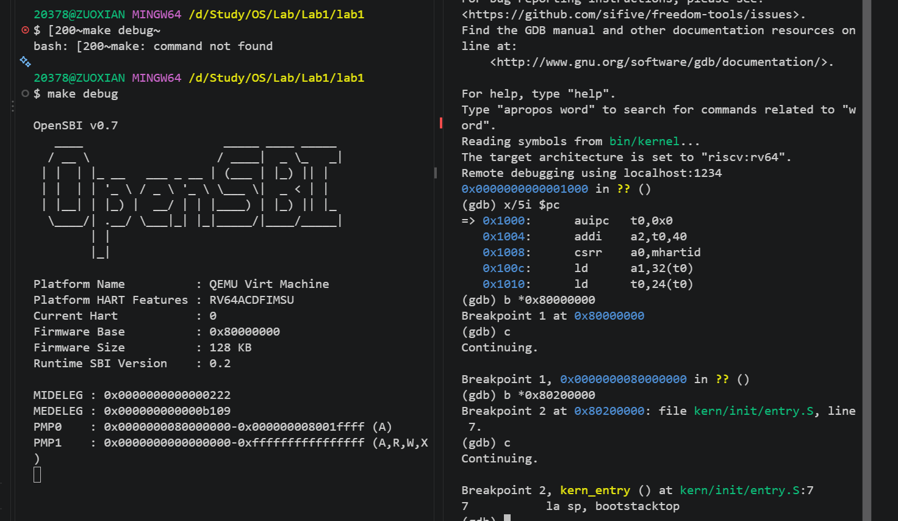
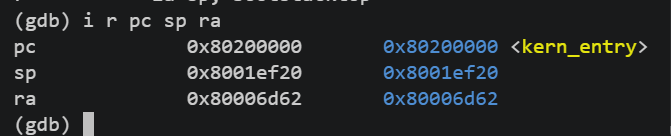
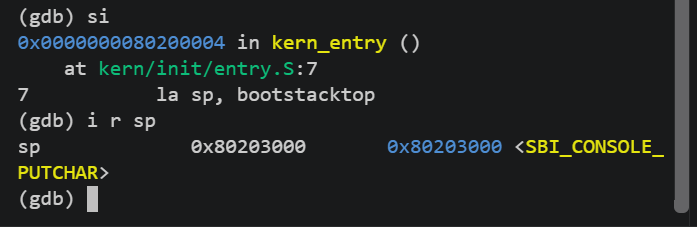
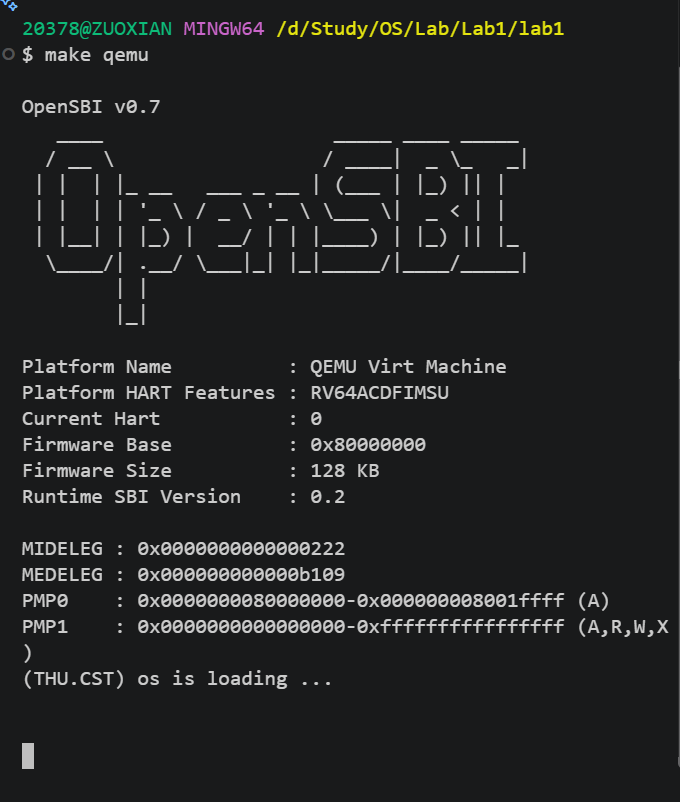

# 操作系统 Lab 1 实验报告：比麻雀更小的麻雀（最小可执行内核）

## 一、 章节整体逻辑线的理解
本实验围绕“构建一个最小可执行内核”展开，按照计算机从硬件裸机加电到运行 C 语言内核的真实时序，自底向上逐步打通底层运行环境：
1. **加电与固件跳转**：理解 RISC-V 计算机的复位流程。QEMU 模拟器启动后，CPU 从复位地址 `0x1000` 开始执行 MROM 中的固件，随后跳转到位于 `0x80000000` 的 OpenSBI 固件，由 OpenSBI 完成最底层的硬件设备初始化，并将内核镜像放置在物理内存 `0x80200000` 处。
2. **内存布局与链接重定位**：通过链接脚本 `tools/kernel.ld` 明确规定内核各段（.text, .rodata, .data, .bss）的内存布局，将汇编入口符号 `kern_entry` 锚定在首地址 `0x80200000`，并借助 `riscv64-unknown-elf-objcopy` 将 ELF 二进制转换为可在裸机上加载的纯镜像 `ucore.img`。
3. **C 运行时栈环境建立**：执行内核第一条汇编指令 `kern/init/entry.S`，为 CPU 设置合法的内核栈指针 `sp`，从而为 C 语言函数调用与局部变量分配提供运行栈，随后通过尾调用（tail call）进入 `kern_init`。
4. **底层 IO 封装与格式化输出**：在没有操作系统第三方运行时库（如 glibc）的前提下，利用内联汇编通过 `ecall` 调用 OpenSBI 提供的 M 态服务（SBI 调用），自底向上封装 `sbi_call` -> `cons_putc` -> `cprintf`，最终在终端上格式化打印启动日志并安全进入死循环。

---

## 二、 核心功能模块与核心函数理解
1. **`tools/kernel.ld`（链接脚本）**：
   * 指定目标架构为 `riscv`，定义基地址 `BASE_ADDRESS = 0x80200000`。
   * 使用正则表达式将 `*(.text.kern_entry)` 严格排布在 `.text` 代码段的最前端，保证内核镜像的第一条机器指令即为入口代码，确保与 OpenSBI 跳转对接的绝对地址一致。
2. **`kern/init/entry.S`（汇编入口）**：
   * 在 `.data` 段定义了大小为 `KSTACKSIZE`（一页/两页大小）的内核栈空间 `bootstack` 到 `bootstacktop`。
   * 指令 `la sp, bootstacktop` 将栈顶高地址加载至 `sp` 寄存器；`tail kern_init` 将控制权转交 C 语言主函数。
3. **`kern/init/init.c`（`kern_init`）**：
   * 引用链接器定义的外部符号 `edata` 和 `end`，调用自定义的 `memset` 对 `.bss` 段执行内存清零，保证未初始化的全局变量具有合法的 0 初始值。
   * 调用 `cprintf` 打印 `(THU.CST) os is loading ...`，随后进入 `while (1)` 死循环挂起 CPU。
4. **`libs/sbi.c`（`sbi_call`）**：
   * 通过 GCC 扩展内联汇编，将 SBI 功能号放入寄存器 `a7`（x17），参数分别传递给 `a0`、`a1`、`a2`，执行 `ecall` 指令触发环境调用，实现从 S 模式向 M 模式的受控特权级跨越；OpenSBI 处理完毕后将返回值存放在 `a0` 中带回。
5. **`kern/driver/console.c` 与 `kern/libs/stdio.c`**：
   * `cons_putc` 封装底层字符输出 `sbi_console_putchar`；`cprintf` 结合 `libs/printfmt.c` 的格式化状态机解析，实现了与标准 C 库 `printf` 功能类似的格式化打印。

---

## 三、 本实验重要知识点与 OS 原理对照分析
| 序号 | 实验中的具体技术点 | 对应 OS 原理中的知识点 | 含义、关系与差异说明 |
| :--- | :--- | :--- | :--- |
| 1 | **特权级划分与 ecall 指令** | CPU 硬件特权级与系统调用机制 | **原理**：操作系统依赖硬件特权级实现内核与应用程序的隔离。 **实验**：RISC-V 划分了 U、S、M 三种特权级。内核处于 S 态，固件处于 M 态。内核通过 `ecall` 陷入 M 态请求打印服务，其调用流程与机制与后续“用户态（U态）通过系统调用请求内核态（S态）服务”完全一致。 |
| 2 | **OpenSBI 固件与 QEMU 加载** | Bootloader（引导加载程序） | **原理**：操作系统内核无法凭空自举，需由固件先完成基本设备检查并将内核代码搬运到主存。 **实验**：OpenSBI 充当 Bootloader，固定加载到 `0x80000000`，并将内核安置在物理地址 `0x80200000`。 |
| 3 | **`kernel.ld` 链接脚本与段排布** | 程序内存布局与地址重定位 | **原理**：编译器与链接器将代码划分为代码段、数据段、BSS段，并计算符号的绝对/相对地址。 **实验**：由于当前未开启虚拟内存分页，链接脚本定义的地址即为实际物理地址，代码具有严格的地址相关性，必须与加载地址一致。 |
| 4 | **`la sp, bootstacktop` 指令** | 进程/内核运行时执行栈初始化 | **原理**：高级语言执行必须具备支持栈帧压入、局部变量保存与函数调用的运行栈。 **实验**：裸机加电后寄存器均为未定义值，必须由第一段汇编手工指定栈顶。 |

---

## 四、 OS 原理重要但本实验中尚未涉及的知识点
1. **中断与异常处理机制（Trap/Interrupt）**：本实验内核仅有顺序执行流，未配置 `stvec` 寄存器以捕获硬件中断或外部异常。
2. **时钟中断与抢占式调度**：未开启 RISC-V 定时器中断，没有多任务抢占和基于时间片调度的概念。
3. **虚拟内存与多级页表（SV39）**：当前内核直接运行在物理内存地址上，MMU（内存管理单元）处于未启用状态，没有虚拟地址到物理地址的映射转换。
4. **用户进程与地址空间隔离**：本实验仅运行了一个 S 模式下的内核主循环，尚未建立用户态（U 模式）上下文及隔离机制。

---

## 五、 练习题解答与 GDB 验证记录

### 练习 1：理解内核启动中的程序入口操作
**问题 1：说明指令 `la sp, bootstacktop` 完成了什么操作，目的是什么？**
* **完成的操作**：利用伪指令 `la`（Load Address）将内核栈顶标号 `bootstacktop` 的地址加载到栈指针寄存器 `sp`（即 x2）。
* **目的**：为进入 C 语言环境分配和建立运行时栈（Stack）。C 语言中的函数调用参数传递、局部变量存储、调用栈帧维护等均依赖于栈。RISC-V 的栈是从高地址向低地址向下增长的，因此必须将 `sp` 初始化在栈空间的最顶端。

**问题 2：说明指令 `tail kern_init` 完成了什么操作，目的是什么？**
* **完成的操作**：执行尾调用（Tail Call）跳转到 C 语言编写的内核主入口函数 `kern_init`。汇编器将其解析为直接跳转指令，不向返回地址寄存器 `ra` 中写入返回地址。
* **目的**：将 CPU 执行权由汇编引导阶段移交给 C 语言内核。因为 `kern_init` 被定义为无限循环（noreturn），内核永远不需要返回到启动汇编中，采用尾调用既符合逻辑，又避免了无谓的栈帧开销。

---

### 练习 2：使用 GDB 验证启动流程
**问题 1：RISC-V 硬件加电后最初执行的几条指令位于什么地址？它们主要完成了哪些功能？**
* **初始地址**：位于 **`0x1000`** 处，属于 QEMU 模拟的 MROM（Machine ROM）只读存储区域。
* **主要功能**：进行最基础的硬件复位环境检查（如读取当前 CPU 核心的 Hart ID），随后通过一条跳转指令将 PC 直接指向 `0x80000000`，将控制权转交给 OpenSBI 固件。

**问题 2：启动流程调试记录与观察结果**

1. **加电复位阶段（地址 0x1000）**
   * GDB 启动连接到 localhost:1234 后，PC 初始停在 `0x1000`。
   * 查看指令：执行 `x/5i $pc`，显示 QEMU 预置在 MROM 中的复位引导汇编指令：
   

2. **OpenSBI 固件启动阶段（地址 0x80000000）**
   * 设置断点：`b *0x80000000` 并执行 `c`，程序成功停在 OpenSBI 入口。
   * 观察结果：控制权正式进入 M 模式的 OpenSBI 固件中执行主初始化流程：
   

3. **内核入口交接阶段（地址 0x80200000）**
   * 设置断点：`b *0x80200000` 并执行 `c`，成功命中内核入口点 `kern_entry`。
   * 观察结果：此时 OpenSBI 完成了串口和硬件环境初始化，并准确跳转到了内核基地址 `0x80200000`：
   

4. **单步执行与栈指针初始化（佐证练习 1）**
   * 刚进入内核时查看寄存器，此时 `sp` 为 OpenSBI 传递的旧地址 `0x8001ef20`：
   
   * 单步执行 `si`（完成 `la sp, bootstacktop`）后，`sp` 成功更新为内核栈顶 `0x80203000`，下一条指令变为 `tail kern_init`：
   

5. **系统启动验证**
   * 在终端执行 `make qemu`，控制台打印出 OpenSBI 字符画以及内核输出字符串 `(THU.CST) os is loading ...`，随后进入死循环挂起：
   